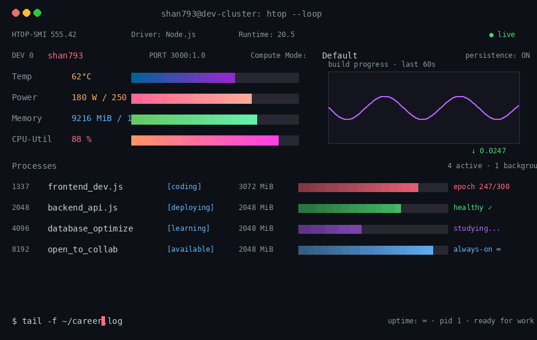

🔴 🟡 🟢             -------Welcome-------

<p align="center">

</p>


$ login

<sub style="color:gray">Welcome to dev-cluster · last login: just now</sub>

$ cat /etc/profile/shan793.ascii

 _  __    _    _   _   _   _   _

<a href="https://github.com/shan793-code">
  
</a>

 $ whoami --short

 
full stack developer · end-to-end · cloud native
 


<p align="center">
 <p align="center">
  <a href="#-whoami">🐚 </a>
  <a href="#-stack">📦 </a>
  <a href="#-stats">📊 </a>
  <a href="#-projects">🛠️ </a>
  <a href="#-connect">📡 </a>
</p>


---

---

## 🐚 whoami

```bash
shan793@dev-cluster:~$ whoami
shan793 · full-stack developer
> building frontend · architecting backend · deploying to cloud

shan793@dev-cluster:~$ uname -a
shan793  5.2026  #fullstack-dev  SMP  x86_64  GNU/Linux   [saudi-arabia → cloud → global]

```
---

## 📦 stack
```bash
shan793@dev-cluster:~$ tree -L 2 ~/.shan793/stack

~/.shan793/stack/
├── frontend/
│   ├── core         →  HTML5 · CSS3 · JavaScript (ES6+)
│   ├── framework    →  React · Next.js · TypeScript
│   ├── styling      →  Tailwind CSS · Bootstrap · SASS
│   └── tools        →  Vite · Webpack · Figma
├── backend/
│   ├── runtime      →  Node.js · Express.js · NestJS
│   ├── language     →  JavaScript · TypeScript · Node.js
│   └── api          →  REST · GraphQL · WebSocket
├── database/
│   ├── sql          →  PostgreSQL · MySQL · SQLite
│   ├── nosql        →  MongoDB · Redis · Firebase
│   └── orm          →  Prisma · Sequelize · Mongoose
├── devops/
│   ├── container    →  Docker · Docker Compose
│   ├── cloud        →  AWS · GCP · DigitalOcean
│   ├── cicd         →  GitHub Actions · GitLab CI
│   └── server       →  Nginx · Linux · Bash
└── tools/
    ├── version      →  Git · GitHub · GitLab
    ├── testing      →  Jest · PyTest · Postman
    ├── docs         →  Markdown · Swagger · Notion
    └── editor       →  VS Code · Cursor · Vim
```

## 🖥️ htop



---

## 📊 stats

```bash
shan793@dev-cluster:~$ git log --author='shan793' --stat
```
<p align="center">
  
</p>

---

## 📡 connect

```bash
shan793@dev-cluster:~$ ./connect.sh --interactive
```

<p align="center">
  <a href="mailto:parachak49@gmail.com">📧 PARACHAK49@GMAIL.COM</a>
  &nbsp;&nbsp;&nbsp;
  <a href="https://linkedin.com/in/k-paracha">🔗 LINKEDIN.COM/IN/K.PARACHA</a>
  &nbsp;&nbsp;&nbsp;
  <a href="https://github.com/shan793-code">⚡ GITHUB/SHAN793</a>
  &nbsp;&nbsp;&nbsp;
  👁️ VISITORS
</p>

```bash
shan793@dev-cluster:~$ exit
> connection closed. logs flushed. commits pushed.
> See you in the next deployment. 🚀
```

<p align="center">
  
</p>
